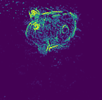
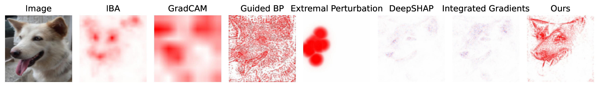

# Fine-Grained Neural Network Explanation by Identifying Input Features with Predictive Information

This repository is the official implementation.

<p align="center"> 
    <br>
    Example Image Mask
</p>

---
## Requirements
1. Install `torch` and `torchvision` (and `torchtext` for NLP tasks) 
   following the official instructions of [pytorch](https://pytorch.org/get-started/locally/)

2. Install `mmcv` or `mmcv-full` following the official instructions of [mmcv](https://github.com/open-mmlab/mmcv).

3. Install additional requirements with `pip install -r requirements.txt`.

4. Install the package in develop mode: `python setup.py develop`. 


## Run Attribution

### Computer Vision Task: Image Classification
1. Download ImageNet validation set. Format the sets to 
   `torchvison.dataset.ImageFolder` style if necessary. Use 
   [this script](tools/generate_small_imagenet.py) to generate two small 
   sets: estimation set and attribution set. The estimation set is for 
   estimating the mean and standard deviation of hidden features, while the 
   attribution set consists of images for the neural network to explain. 
   Cop [this json file](resources/imagenet_class_index.json) to the dataset 
   root. The dataset should have following structure:
   ```shell 
   .
   |-- annotations
   |   `-- attribution
   |   |   |-- n01440764
   |   |   |-- n01443537
   |   |   |-- n01484850
   |   |   ...  
   |-- imagenet_class_index.json
   `-- images
       |-- attribution
       |   |-- n01440764
       |   |-- n01443537
       |   |-- n01484850
       |   ...
       `-- estimation 
       |   |-- n01440764
       |   |-- n01443537
       |   |-- n01484850
       |   ...
   ```
   **Note** that the `annotations/` directory is only necessary for evaluating 
   localization ability of attribution methods (the EHR metric proposed in the 
   paper). One can modify line 35 in 
   [the config file](configs/_base_/imagenet.py) to `with_bbox=False`, if 
   no bounding box annotations are available.
   
   **We also provide a preprocessed small ImageNet dataset, which can be 
   downloaded from 
   [this link](https://drive.google.com/file/d/1LBKQ4BR3zepfnQAKCumkABHYjXBanBBL/view?usp=sharing)**
   
2. Create a directory under this repository: `mkdir data`, and link the 
   imagenet data path to `data/imagenet` : 
   `ln -s path/to/imagenet_data/ data/imagenet`.
3. Create a directory to store the output files `mkdir workdirs`.
4. Run training script with specified configuration file (e.g. 
   [vgg16_imagenet](configs/vgg_imagenet.py)) to train the attributor:
   ```shell
   python tools/vision/train.py \
       configs/vgg_imagenet.py \
       --work-dir workdirs/vgg_imagenet/ \
       --gpu-id 0 \
       --pbar 
   ```

5. Check the results saved in `workdirs/vgg_imagenet/`: `input_masks/` 
   contains the final attribution maps, while `feat_masks/` contains the 
   attribution maps produced by the IB at feature map level (the original 
   [IBA](https://arxiv.org/abs/2001.00396))
   
### NLP Task: Sentence Classification
1. We provide a pretrained multi-layer LSTM on IMDb dataset. Download the 
   checkpoint file from 
   [this link](https://drive.google.com/file/d/15BReuKWEuHe7ZDhxKaNLquScKgAiAiLG/view?usp=sharing).
 
2. `mkdir pretrained` and move the downloaded checkpoint file to `pretrained`.

3. Run training script with specified configuration 
   ([deep_lstm](configs/deep_lstm.py)) to train the attributor:
   ```shell
   python tools/nlp/train_nlp.py \
       configs/deep_lstm.py \
       --work-dir workdirs/lstm_imdb/ \
       --gpu-id 0 \
       --pbar
   ```
4. Check the results saved in `workdirs/lstm_imdb/`: `input_masks/` contains 
   the final attribution maps (at word level), while `feat_masks/` contains 
   the attribution maps produced by the IB at feature map level.

## Pre-trained Models
Like many attribution methods, our method can only be applied in a per-image 
manner. For each new image, the `Attributor` will train new components 
(`FeatureIBA`, `WGAN`, `InputIBA`). 
Thus, there is no need to provide any pre-trained models here.

## Run Evaluation
### Computer Vision: Sanity Check, Insertion Deletion, Sensitivity-N, EHR
Experiments of this part require an addition json file that records the 
predicted probability of the ground truth class of each image. We use it to 
filter out the samples that have low confidence on target class. For the small 
ImageNet dataset downloaded from the aforementioned link, we also provided 
a json file [here](resources/target_scores.json). One can also obtain the json
file by running:
`python tools/vision/get_target_scores.py configs/vgg_imagenet.py 
workdirs/vgg_imagenet/target_scores/ target_scores.json`.

If using our provided json file, copy the file from `resources` to 
`workdirs` by `mkdir workdirs/vgg_imagenet/target_scores/ && cp 
resources/target_scores.json workdirs/vgg_imagenet/target_scores/`
#### Sanity Check
1. Assume the `workdirs/vgg_imagenet/input_masks/` contains the final 
   attribution maps. Run:
```shell 
python tools/vision/sanity_check.py \
   configs/sanity_check.py \
   workdirs/vgg_imagenet/input_masks/ \
   workdirs/vgg_imagenet/sanity_check/ \
   vgg_sanity_check.json \
   --scores-file workdirs/vgg_imagenet/target_scores/target_scores.json
```
2. Check results in `workdirs/vgg_imagenet/sanity_check/`

#### Insertion Deletion
1. Run 
```shell
python tools/vision/insertion_deletion.py \
  configs/vgg_imagenet.py \
  workdirs/vgg_imagenet/input_masks/ \
  workdirs/vgg_imagenet/insertion_deletion/ \
  vgg_insertion_deletion.json \
  --scores-file workdirs/vgg_imagenet/target_scores/target_scores.json \
  --sigma 15 \
  --num-samples 2000
```
2. Check results in `workdirs/vgg_imagenet/insertion_deletion`.

#### Sensitivity-N
1. Run
```shell
python tools/vision/sensitivity_n.py \
  configs/vgg_imagenet.py \
  workdirs/vgg_imagenet/input_masks/ \
  workdirs/vgg_imagenet/sensitivity_n/ \
  vgg_sensitivity_n.json \
  --scores-file workdirs/vgg_imagenet/target_scores/target_scores.json \
  --num-masks 100 \
  --num-samples 1000
```
2. Check results in `workdirs/vgg_imagenet/sensitivity_n/`.


#### EHR
1. Run 
```shell
python tools/vision/evaluate_ehr.py \
  configs/vgg_imagenet.py \
  workdirs/vgg_imagenet/input_masks/ \
  workdirs/vgg_imagenet/ehr/ \
  vgg_ehr.json \
  --weight \
  --scores-file workdirs/vgg_imagenet/target_scores/target_scores.json \
```
2. Check the files in `workdirs/vgg_imagenet/ehr/`.

### NLP: Insertion Deletion, Sensitivity-N
Assume `workdirs/lstm_imdb/input_masks/` stores the final attribution maps.
#### Insertion Deletion
1. Run:
```shell
python tools/nlp/nlp_insertion_deletion.py \
  configs/deep_lstm.py \
  workdirs/lstm_imdb/input_masks/ \
  workdirs/lstm_imdb/insertion_deletion/ \
  lstm_insertion_deletion.json
```
2. Check the results in `workdirs/lstm_imdb/insertion_deletion/`.

#### Sensitivity-N
1. Run:
```shell
python tools/nlp/nlp_sensitivity_n.py \
  configs/deep_lstm.py \
  workdirs/lstm_imdb/input_masks/ \
  workdirs/lstm_imdb/sensitivity_n/ \
  lstm_sensitivity_n.json \
  --num-masks 100
```
2. Check the results in `work_dirs/lstm_imdb/sensitivity_n/`.

## Example Results
Here is an example of attribution maps produced by various attribution 
methods. By inspection, we can see that the attribution map of our method 
is much more fine-grained than the other ones. 


## License
This repository is released under the MIT license.


