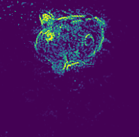

# Information Bottleneck Attribution (to be renamed)
<p align="center"> 
    <br>
    Example Image Mask
</p>


---
## Installation
1. Install `torch` and `torchvision` following the official instructions of [pytorch](https://pytorch.org/get-started/locally/)

2. Install `mmcv` or `mmcv-full` following the official instructions of [mmcv](https://github.com/open-mmlab/mmcv).

3. Install additional requirements with `pip install -r requirements.txt`.

4. Install the package in develop mode: `python setup.py develop`.


## Run Attribution
1. create a working directory, say `work_dir`
2. run training script with specified configuration file:
    ```shell
    python tools/train.py path/to/config_file.py --work-dir work_dir --gpu-id 0
    ```
3. Check the results saved in `work_dir`.
