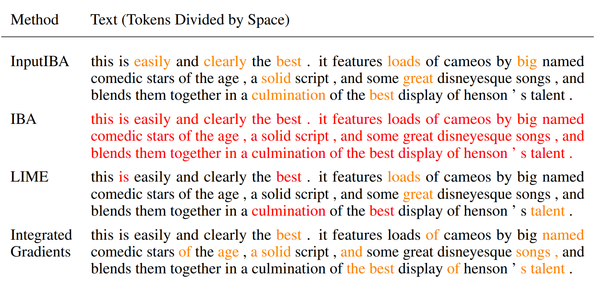

# InputIBA: Fine-Grained Neural Network Explanation by Identifying Input Features with Predictive Information
This repository is the official implementation of [our paper](https://arxiv.org/abs/2110.01471). We propose an attribution method called **___InputIBA___** to have input-level explanation by leveraging a information-botleneck on latent layer and a GAN to fit distributions. For details of the method please refer to our paper. Other information can be found from the [project's homepage](https://camp-explain-ai.github.io/InputIBA/).

The method results to **fine-grained** attribution map, which is directly optimized on the input, so the attribution has the resolution of input and can provide more details. From the example below, the generated attribution map is directly reflecting regions of interest for NN model's decision, and other similar features (like coins in the image) are ruled out.

<p align="center"> 
    <br>
    Image Mask
</p>

Moreover, our method released some assumptions of the previous method, resulting to our method being model-agnostic. We demostrated this model-agnostic ability on both **vision** and **NLP** tasks, e.g. **recurrent neural network and convolutional neural network**. 


---
## Example Results
Here is an example of attribution maps produced by various attribution 
methods. By inspection, we can see that the attribution map of our method 
is much more fine-grained than other explanation methods. 


Another example of identifing informative tokens (words & symbols). 
Our method has highlighed important features, and the result is more interpretable to humans compare to other methods.


## Requirements
1. Install `torch` and `torchvision` (and `torchtext` for NLP tasks) 
   following the official instructions of [pytorch](https://pytorch.org/get-started/locally/)

2. Install `mmcv` or `mmcv-full` following the official instructions of [mmcv](https://github.com/open-mmlab/mmcv).  
Since our code only uses limited features from MMCV, a lite version can be simply installed with `pip install mmcv`

3. Install additional requirements with `pip install -r requirements.txt`.

4. Install the package in develop mode: `python setup.py develop`. 


## Run Attribution
### Jupytor Notebook as hands-on tutorial
We provide two jupyter notebooks for NLP and Computer Vision task under `tutorials/`, the tutorial notebooks provide a interactive way for showing how to run 
attribution with InputIBA on single sample.

Two jupyter notebooks are [here for vision task](tutorials/vision_attribution.ipynb) 
and [here for NLP task](tutorials/nlp_attribution.ipynb) .

### Batch-wise attribution generation
The below scripts works for batch generation of attribution.

#### Computer Vision Task: Image Classification
1. Download ImageNet validation set. Format the sets to 
   `torchvison.dataset.ImageFolder` style if necessary. Use 
   [this script](tools/generate_small_imagenet.py) to generate two small 
   sets: estimation set and attribution set. The estimation set is for 
   estimating the mean and standard deviation of hidden features, while the 
   attribution set consists of images for the neural network to explain. 
   Cop [this json file](resources/imagenet_class_index.json) to the dataset 
   root. The dataset should have following structure:
   ```shell 
   .
   |-- annotations
   |   `-- attribution
   |   |   |-- n01440764
   |   |   |-- n01443537
   |   |   |-- n01484850
   |   |   ...  
   |-- imagenet_class_index.json
   `-- images
       |-- attribution
       |   |-- n01440764
       |   |-- n01443537
       |   |-- n01484850
       |   ...
       `-- estimation 
       |   |-- n01440764
       |   |-- n01443537
       |   |-- n01484850
       |   ...
   ```
   **Note** that the `annotations/` directory is only necessary for evaluating 
   localization ability of attribution methods (the EHR metric proposed in the 
   paper). One can modify line 35 in 
   [the config file](configs/_base_/imagenet.py) to `with_bbox=False`, if 
   no bounding box annotations are available.
   
   **We also provide a preprocessed small ImageNet dataset, which can be 
   downloaded from 
   [this link](https://drive.google.com/file/d/1LBKQ4BR3zepfnQAKCumkABHYjXBanBBL/view?usp=sharing)**
   
2. Create a directory under this repository: `mkdir data`, and link the 
   imagenet data path to `data/imagenet` : 
   `ln -s path/to/imagenet_data/ data/imagenet`.
3. Create a directory to store the output files `mkdir workdirs`.
4. Run training script with specified configuration file (e.g. 
   [vgg16_imagenet](configs/vgg_imagenet.py)) to train the attributor:
   ```shell
   python tools/vision/train.py \
       configs/vgg_imagenet.py \
       --work-dir workdirs/vgg_imagenet/ \
       --gpu-id 0 \
       --pbar 
   ```

5. Check the results saved in `workdirs/vgg_imagenet/`: `input_masks/` 
   contains the final attribution maps, while `feat_masks/` contains the 
   attribution maps produced by the IB at feature map level (the original 
   [IBA](https://arxiv.org/abs/2001.00396))
   
#### NLP Task: Sentence Classification
1. We provide a pretrained multi-layer LSTM on IMDb dataset. Download the 
   checkpoint file from 
   [this link](https://drive.google.com/file/d/15BReuKWEuHe7ZDhxKaNLquScKgAiAiLG/view?usp=sharing).
 
2. `mkdir pretrained` and move the downloaded checkpoint file to `pretrained`.

3. Run training script with specified configuration 
   ([deep_lstm](configs/deep_lstm.py)) to train the attributor:
   ```shell
   python tools/nlp/train_nlp.py \
       configs/deep_lstm.py \
       --work-dir workdirs/lstm_imdb/ \
       --gpu-id 0 \
       --pbar
   ```
4. Check the results saved in `workdirs/lstm_imdb/`: `input_masks/` contains 
   the final attribution maps (at word level), while `feat_masks/` contains 
   the attribution maps produced by the IB at feature map level.


## Pre-trained Models
Like many attribution methods, our method can only be applied in a per-image 
manner. For each new image, the `Attributor` will train new components 
(`FeatureIBA`, `WGAN`, `InputIBA`). Attribution methods are used for explain already trained models.
Thus, there is no need to provide any pre-trained models here.

## Run Evaluation
We implemented a handful of evaluation metrics including **Sanity Check**, **Insertion/Deletion**, **Sensitivity-N**, and our own proposed metric called **EHR (Effective Heat Ratios)**.
Details of how to run evaluations on attribution methods can be found in `Input_iba/evaluation` or just click [here](/input_iba/evaluation).

## License
This repository is released under the MIT license.


